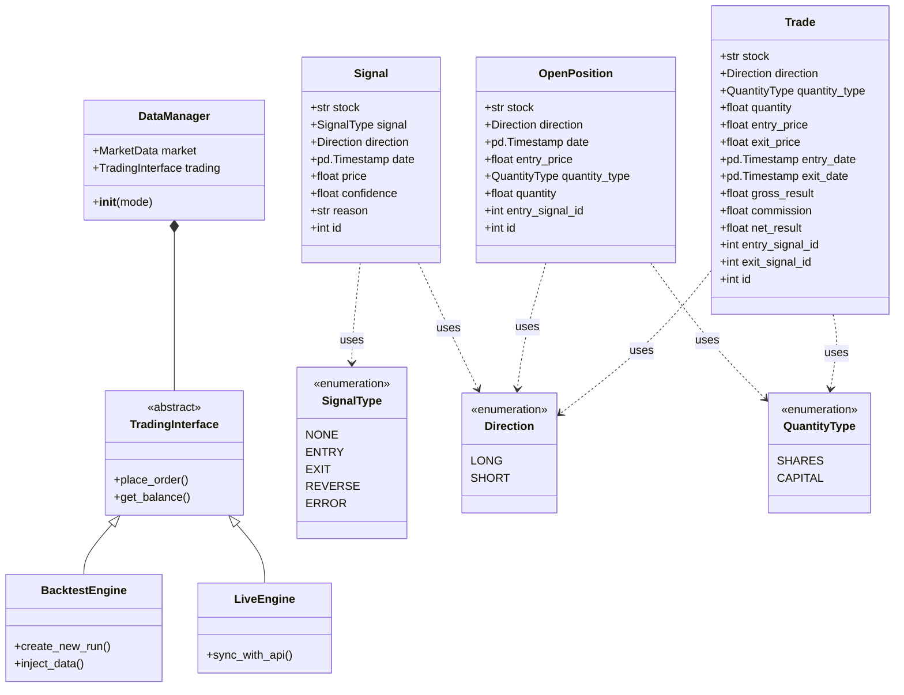

```mermaid
classDiagram
    %% --- Core System ---
    class DataManager {
        +MarketData market
        +TradingInterface trading
        +__init__(mode)
    }
    class TradingInterface {
        <<abstract>>
        +place_order()
        +get_balance()
    }
    class BacktestEngine {
        +create_new_run()
        +inject_data()
    }
    class LiveEngine {
        +sync_with_api()
    }
    
    DataManager *-- TradingInterface
    TradingInterface <|-- BacktestEngine
    TradingInterface <|-- LiveEngine

    %% --- Domain Layer (common.py) ---
    class SignalType {
        <<enumeration>>
        NONE
        ENTRY
        EXIT
        REVERSE
        ERROR
    }
    class Direction {
        <<enumeration>>
        LONG
        SHORT
    }
    class QuantityType {
        <<enumeration>>
        SHARES
        CAPITAL
    }

    %% --- Domain Layer (signals.py) ---
    class Signal {
        +str stock
        +SignalType signal
        +Direction direction
        +pd.Timestamp date
        +float price
        +float confidence
        +str reason
        +int id
    }

    %% --- Domain Layer (positions.py) ---
    class OpenPosition {
        +str stock
        +Direction direction
        +pd.Timestamp date
        +float entry_price
        +QuantityType quantity_type
        +float quantity
        +int entry_signal_id
        +int id
    }

    class Trade {
        +str stock
        +Direction direction
        +QuantityType quantity_type
        +float quantity
        +float entry_price
        +float exit_price
        +pd.Timestamp entry_date
        +pd.Timestamp exit_date
        +float gross_result
        +float commission
        +float net_result
        +int entry_signal_id
        +int exit_signal_id
        +int id
    }

    %% --- Relationships ---
    Signal ..> SignalType : uses
    Signal ..> Direction : uses
    OpenPosition ..> Direction : uses
    OpenPosition ..> QuantityType : uses
    Trade ..> Direction : uses
    Trade ..> QuantityType : uses
```